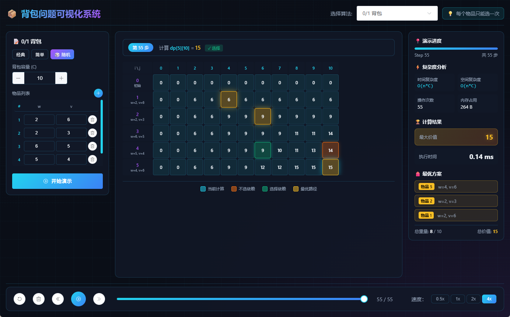
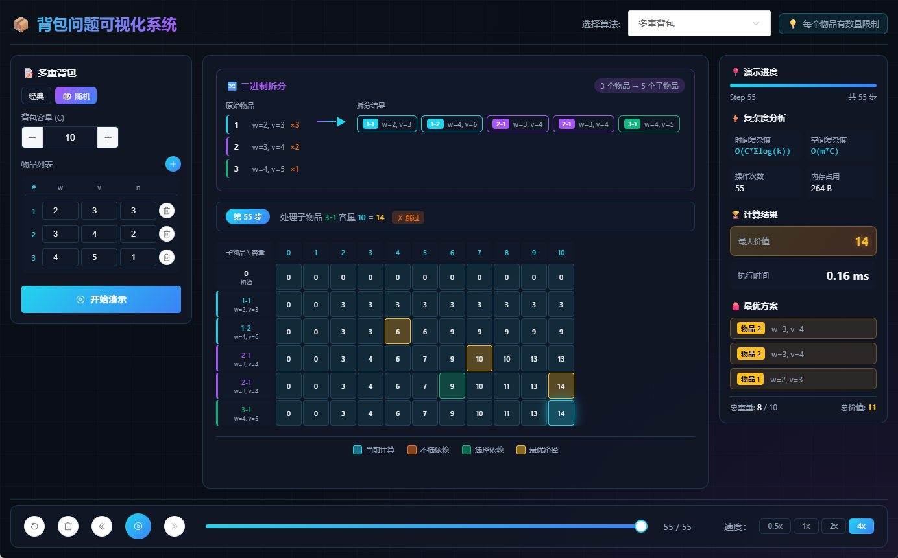
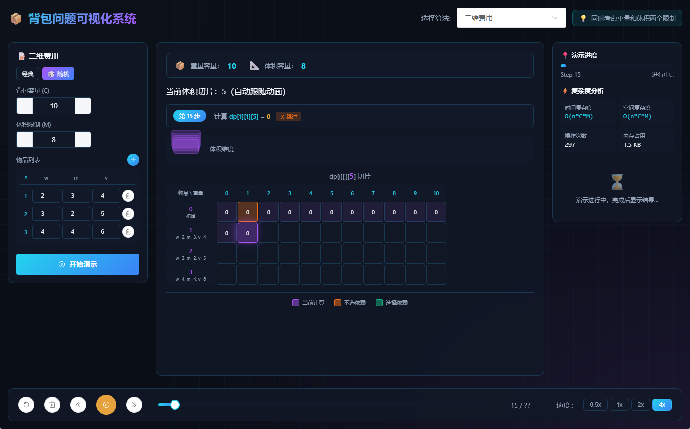
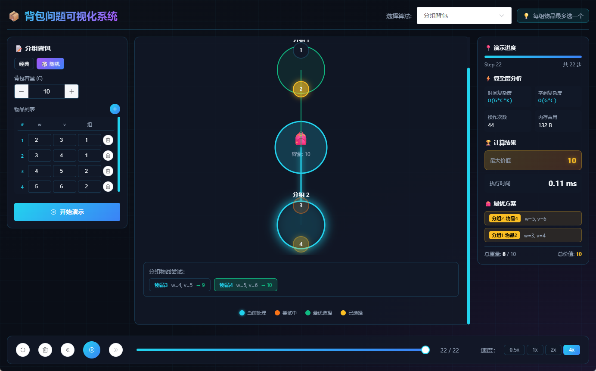
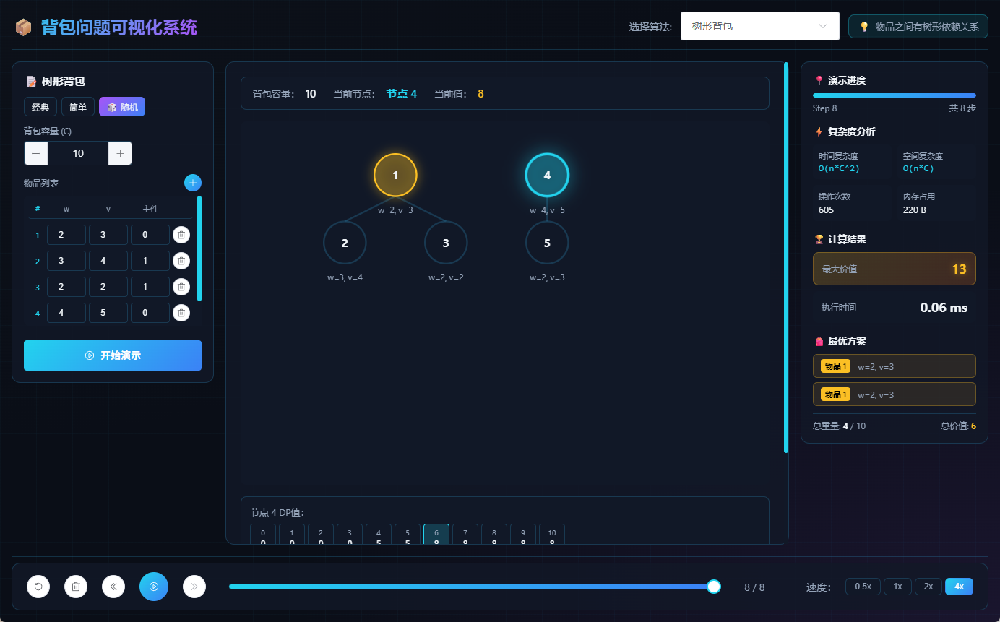
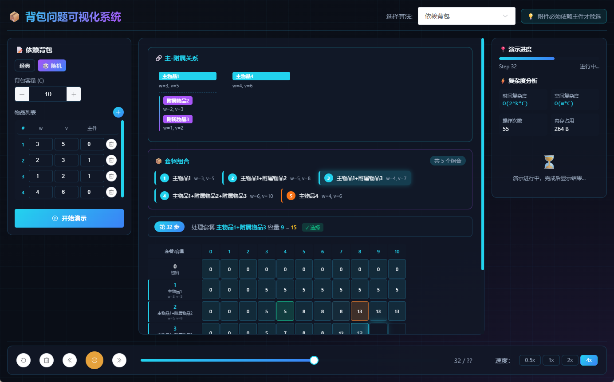

# Knapsack Visualizer

一个基于 Electron + Vue 3 + C++ 的动态规划算法可视化演示系统，支持 10 种经典背包问题算法。

## 🎯 功能特性

- **10 种背包算法可视化**
  - 0/1 背包、完全背包、多重背包、混合背包
  - 二维费用背包、分组背包、依赖背包、树形背包
  - 第K优解、方案计数

- **实时动画演示**：逐步展示 DP 状态转移过程，直观理解算法原理

- **交互式界面**：支持自定义输入、预设案例、随机生成

- **性能分析**：显示算法复杂度和执行时间

- **多语言 UI**：完全中文界面

## 📸 演示截图

### 0/1 背包


### 多重背包


### 二维费用背包


### 分组背包


### 树形背包


### 依赖背包


## 🚀 快速开始

### 前置要求

- **Node.js** >= 16.0
- **npm** >= 8.0
- **g++** (用于编译 C++ 算法)
  - Windows: 安装 [MinGW](https://www.mingw-w64.org/) 或 [TDM-GCC](https://jmeubank.github.io/tdm-gcc/)
  - macOS: `xcode-select --install`
  - Linux: `sudo apt-get install build-essential`

### 安装步骤

#### 1. 安装依赖

```bash
npm install
```

#### 2. 编译 C++ 算法

```bash
cd cpp

# Windows
.\build.bat

# macOS/Linux
./build.sh
```

#### 3. 开发模式运行

```bash
npm run dev
```

### 打包发布

```bash
# Windows - 生成 Knapsack Visualizer.exe
npm run build:win

# macOS - 生成 Knapsack Visualizer.dmg
npm run build:mac

# Linux - 生成 Knapsack Visualizer.AppImage
npm run build:linux
```

打包完成后，安装程序在 `dist/` 目录下。

## 📁 项目结构

```
├── src/
│   ├── main/
│   │   └── index.js                    # Electron 主进程（IPC通信、C++调用）
│   ├── preload/
│   │   └── index.js                    # 预加载脚本（安全上下文）
│   └── renderer/
│       ├── index.html                  # 应用入口 HTML
│       └── src/
│           ├── App.vue                 # 主应用组件
│           ├── main.js                 # Vue 应用初始化
│           ├── assets/                 # 静态资源
│           └── components/             # Vue 组件
│               ├── InputPanel.vue      # 输入参数面板
│               ├── ControlBar.vue      # 播放控制栏
│               ├── InfoPanel.vue       # 结果信息面板
│               ├── DPGrid.vue          # DP 表格视图
│               ├── TreeView.vue        # 树形背包可视化
│               ├── GroupCircleView.vue # 分组背包圆环视图
│               ├── DependencyView.vue  # 依赖背包套餐视图
│               ├── MultipleKnapsackView.vue  # 多重背包拆分视图
│               └── TwoDimensionView.vue      # 二维费用切片视图
├── cpp/
│   ├── build.bat                       # Windows 编译脚本
│   ├── knapsack_01.cpp                 # 0/1 背包算法
│   ├── knapsack_complete.cpp           # 完全背包算法
│   ├── knapsack_multiple.cpp           # 多重背包算法
│   ├── knapsack_mixed.cpp              # 混合背包算法
│   ├── knapsack_2d.cpp                 # 二维费用背包算法
│   ├── knapsack_group.cpp              # 分组背包算法
│   ├── knapsack_depend.cpp             # 依赖背包算法
│   ├── knapsack_tree.cpp               # 树形背包算法
│   ├── knapsack_kth.cpp                # 第K优解算法
│   └── knapsack_count.cpp              # 方案计数算法
├── build/                              # 构建资源
├── resources/                          # 应用资源
├── image/                              # 演示截图
├── package.json                        # 项目依赖配置
├── electron-builder.yml                # Electron 打包配置
├── electron.vite.config.mjs            # Vite 构建配置
└── README.md                           # 项目说明
```

## 🛠 技术栈

| 技术 | 版本 | 用途 |
|------|------|------|
| Vue | 3.5+ | 前端框架 |
| Electron | 39+ | 桌面应用框架 |
| Vite | 7+ | 构建工具 |
| Element Plus | 2.13+ | UI 组件库 |
| C++ | 17 | 算法实现 |

## 📖 使用指南

1. **选择算法**：从左侧菜单选择要演示的背包问题类型
2. **输入参数**：设置背包容量和物品信息
3. **开始演示**：点击"开始演示"按钮
4. **控制播放**：使用播放/暂停、上一步/下一步按钮控制演示进度
5. **调整速度**：使用速度按钮调整动画播放速度

## 🎓 算法说明

### 0/1 背包
每个物品最多选择一次，求最大价值。

### 完全背包
每个物品可以选择无限次，求最大价值。

### 多重背包
每个物品有限定数量，求最大价值。

### 混合背包
结合 0/1、完全、多重背包的特性。

### 二维费用背包
物品有两个维度的消耗（如重量和体积）。

### 分组背包
物品分组，每组最多选一个。

### 依赖背包
物品间存在依赖关系（主物品和附属物品）。

### 树形背包
物品构成树形结构的依赖关系。

### 第K优解
求第 K 个最优解。

### 方案计数
计算所有最优方案的数量。

